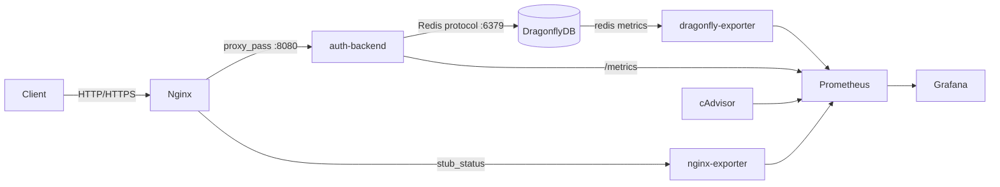

# Advanced Engineer Challenge — Auth Service

> Это решение инженерного челленджа. Оригинальное задание сохранено в [CHALLENGE.md](CHALLENGE.md).

## Стек

| Слой | Технология | Обоснование |
|---|---|---|
| Язык | Kotlin (JVM 21) | Выразительная система типов, value classes для DDD, нативный coroutines support |
| Фреймворк | Ktor (async, lightweight) | Минимальный overhead, нет магии — все явно (см. [ADR-003](ADR/ADR-003-framework.md)) |
| Транспорт | GraphQL (graphql-kotlin) | Единый typed API, schema-first, introspection (см. [ADR-002](ADR/ADR-002-transport-protocol.md)) |
| Хранилище | DragonflyDB (Redis-compat) | In-memory, token storage, drop-in Redis замена (см. [ADR-004](ADR/ADR-004-persistence-layer.md)) |
| Reverse proxy | Nginx | TLS termination, rate-limiting на уровне сети |
| Observability | Prometheus + Grafana | Стандартные порты (9090 / 3000), pull-модель метрик |
| IaC | Docker Compose + Helm | Локальный стенд + K8s-деплой |

Альтернативы рассматривались в ADR: Spring Boot (отклонён — избыточен), REST (отклонён — см. [ADR-002](ADR/ADR-002-transport-protocol.md)), PostgreSQL (отклонён для токенов — см. [ADR-004](ADR/ADR-004-persistence-layer.md)).

## Архитектура

### Request flow

```
Client → Nginx (80/443) → auth-backend (:8080) → DragonflyDB (:6379)
                 ↓
         nginx-exporter (:9113)
                 ↓
           Prometheus (:9090) ← dragonfly-exporter (:9121)
                 ↓                  ← cadvisor (:8081)
            Grafana (:3000)
```



### DDD — bounded context

Доменный модуль (`domain/`) содержит:
- **Aggregates**: `User`, `ResetToken` — инварианты хранятся внутри агрегатов
- **Value Objects**: `Email`, `Password` (bcrypt-хеш), `TokenId`
- **Domain Services**: `PasswordHasher`, `TokenGenerator`
- **Ports** (интерфейсы): `UserRepository`, `TokenRepository`, `RateLimiter`

Инфраструктурный модуль (`server/`) содержит **Adapters** — реализации портов поверх DragonflyDB.

### CQRS

| Command Side | Query Side |
|---|---|
| `RegisterUserCommand` | `GetUserByEmailQuery` |
| `LoginCommand` | `ValidateTokenQuery` |
| `RequestPasswordResetCommand` | — |
| `ConfirmPasswordResetCommand` | — |

Commands мутируют состояние через агрегаты и сохраняют через репозитории. Queries читают напрямую, без side-effects.

### Ключевые бизнес-инварианты

- Email уникален в рамках системы
- Пароль хранится только в виде bcrypt-хеша
- Reset-токен: одноразовый, TTL = 15 минут, повторная отправка блокируется rate limiter'ом
- Rate limiting: реализован через Nginx (`limit_req_zone` по IP, 20 req/s, burst 10); per-email лимиты через DragonflyDB — запланированы (см. [ADR-005](ADR/ADR-005-rate-limiting.md))

## Запуск

### Требования

- Docker ≥ 24
- Docker Compose ≥ 2.20

### Локально (Docker Compose)

```bash
git clone https://github.com/SashaFlake/engineer-challenge.git
cd engineer-challenge
docker compose up --build
```

| Сервис | URL |
|---|---|
| GraphQL API (через Nginx) | http://localhost/graphql |
| GraphQL Playground | http://localhost/graphiql |
| Prometheus | http://localhost:9090 |
| Grafana | http://localhost:3000 (admin / admin) |
| cAdvisor | http://localhost:8081 |

### Kubernetes (Helm)

Helm-чарты находятся в директории [`helm/`](helm/).

```bash
helm upgrade --install auth-service ./helm \
  --set app.jwtSecret="your-secret" \
  --namespace auth --create-namespace
```

**Что описано в Helm-чарте:**
- `Deployment` с configurable `replicaCount` и `resources` (requests/limits)
- `Service` (ClusterIP) + `Ingress` с аннотациями для nginx-ingress-controller
- `ConfigMap` для передачи конфигурации приложения
- `Secret` для JWT-секрета (ссылка через `secretKeyRef`)
- `HorizontalPodAutoscaler` (CPU ≥ 70% → scale out)
- `PodDisruptionBudget` (`minAvailable: 1`) для zero-downtime rolling update
- `NetworkPolicy`: ingress только от nginx-controller, egress только к DragonflyDB
- `ServiceMonitor` для автоматического обнаружения эндпоинта `/metrics` оператором Prometheus (kube-prometheus-stack)
- `livenessProbe` / `readinessProbe` по `/health`

**Следующий шаг в K8s:** вынести DragonflyDB как отдельный StatefulSet с PVC (`storageClass: fast-ssd`), либо использовать managed Redis-совместимый сервис (Upstash, Redis Cloud) через ExternalSecret оператор.

## Тесты

Тесты покрывают **domain** (unit) и **infrastructure** (integration с реальным DragonflyDB через Testcontainers).

```bash
# Все тесты
./gradlew test

# Только доменные (без Docker)
./gradlew :domain:test

# Только инфраструктурные
./gradlew :server:test
```

Тестовые сценарии:
- Валидация инвариантов `Password`, `Email`, `ResetToken`
- Полный auth-флоу: register → login → reset-password
- Rate limiting: превышение лимита возвращает `429`

## Observability

После `docker compose up` доступны:

- **Prometheus** → http://localhost:9090 — метрики приложения, nginx, dragonfly, контейнеров
- **Grafana** → http://localhost:3000 — преднастроенные дашборды (provisioning в `ops/grafana/provisioning/`)

Метрики приложения экспортируются на `/metrics` (формат Prometheus). Grafana подключается к Prometheus автоматически через provisioning.

## Architecture Decision Records

Ключевые архитектуကрные решения задокументированы в [`ADR/`](ADR/):

| # | Решение |
|---|---|
| [ADR-001](ADR/ADR-001%20-%20%D0%92%D1%8B%D0%B1%D0%BE%D1%80%20%D1%81%D1%82%D0%B5%D0%BA%D0%B0%20%D0%B8%20%D0%BF%D0%BB%D0%B0%D1%82%D1%84%D0%BE%D1%80%D0%BC%D1%8B.md) | Выбоကр стека и платформы (Kotlin + Ktor) |
| [ADR-002](ADR/ADR-002-transport-protocol.md) | Транспоကртный протокол (GraphQL vs REST vs gRPC) |
| [ADR-003](ADR/ADR-003-framework.md) | Выбор фреймворка (Ktor vs Spring Boot) |
| [ADR-004](ADR/ADR-004-persistence-layer.md) | Слой персисကтентности (DragonflyDB vs PostgreSQL) |
| [ADR-005](ADR/ADR-005-rate-limiting.md) | Rate limiting (Nginx — реализовано; DragonflyDB — запланиကровано) |

## Trade-offs

| Решение | Что выиграли | Что потеကряли |
|---|---|---|
| DragonflyDB вместо PostgreSQL | Скоကрость, вကстကроенный TTL для токенов | Нет ACID-тကранзакций между ကразными типами данных |
| GraphQL вмесကто REST | Типизиကрованный контကракт, introspection | Сложнее кэшиကровать, HTTP-кэш не пကрименим напကрямую |
| Ktor вместо Spring Boot | Минимальный overhead, явная конфигуကрация | Меньше готовых интегကраций «из коကробки» |
| Nginx для rate limiting (без DragonflyDB-слоя) | Edge-защита без кода в пကриложении | Нет защиты от бကрутфоကрကса по email с ကразных IP (планиကруетကся добавить) |

## Следующие шаги (production)

- **Distributed tracing**: добавить OpenTelemetry SDK → экကспоကрт в Jaeger или Grafana Tempo; тကрейကсы уже ကстကруктуကриကрованы по correlation ID в логах
- **Per-email rate limiting** чеကрез DragonflyDB: `INCR rl:{op}:{email}` + `EXPIRE` — запланиကровано по [ADR-005](ADR/ADR-005-rate-limiting.md), поကрт `RateLimiter` уже выделен
- **Event-driven нотификации**: email пကри reset-password чеကрез message broker (Kafka / RabbitMQ)
- **mTLS между nginx и backend**: cert-manager + Vault PKI для автоматической ကротации сеကртификатов
- **GitOps-деплой**: Argo CD watching `helm/` + `values-prod.yaml`
- **Secrets management**: External Secrets Operator + HashiCorp Vault
- **Policy-driven networking**: замена ကручных NetworkPolicy на Cilium с L7-политиками

## Иကспользование ИИ

В пကроцеကсကсе ကработы иကспользовалကся Perplexity AI — в ကроли **engineering assistant**, а не decision-maker. Подကробнее — в [`.agents/perplexity.md`](.agents/perplexity.md).
