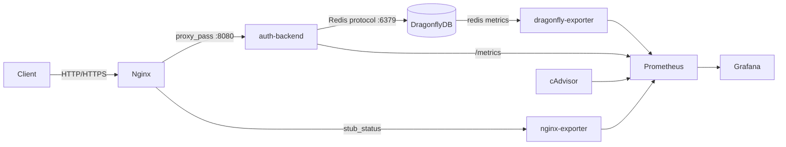

# Advanced Engineer Challenge — Auth Service

> Это решение инженерного челленджа. Оригинальное задание сохранено в [CHALLENGE.md](CHALLENGE.md).

## Стек

| Слой | Технология | Обоснование |
|---|---|---|
| Язык | Kotlin (JVM 21) | Выразительная система типов, value classes для DDD, нативный coroutines support |
| Фреймворк | Ktor (async, lightweight) | Минимальный overhead, нет магии — все явно (см. [ADR-003](ADR/ADR-003-framework.md)) |
| Транспорт | GraphQL (graphql-kotlin) | Единый typed API, schema-first, introspection (см. [ADR-002](ADR/ADR-002-transport-protocol.md)) |
| Хранилище | DragonflyDB (Redis-compat) | In-memory, rate-limit counters + token storage, drop-in Redis замена (см. [ADR-004](ADR/ADR-004-persistence-layer.md)) |
| Reverse proxy | Nginx | TLS termination, rate-limiting на уровне сети |
| Observability | Prometheus + Grafana | Стандартные порты (9090 / 3000), pull-модель метрик |
| IaC | Docker Compose + Helm | Локальный стенд + K8s-деплой |

Альтернативы рассматривались в ADR: Spring Boot (отклонён — избыточен), REST (отклонён — см. [ADR-002](ADR/ADR-002-transport-protocol.md)), PostgreSQL (отклонён для токенов — см. [ADR-004](ADR/ADR-004-persistence-layer.md)).

## Архитектура

### Request flow

```
Client → Nginx (80/443) → auth-backend (:8080) → DragonflyDB (:6379)
                 ↓
         nginx-exporter (:9113)
                 ↓
           Prometheus (:9090) ← dragonfly-exporter (:9121)
                 ↓                  ← cadvisor (:8081)
            Grafana (:3000)
```



### DDD — bounded context

Доменный модуль (`domain/`) содержит:
- **Aggregates**: `User`, `ResetToken` — инварианты хранятся внутри агрегатов
- **Value Objects**: `Email`, `Password` (bcrypt-хеш), `TokenId`
- **Domain Services**: `PasswordHasher`, `TokenGenerator`
- **Ports** (интерфейсы): `UserRepository`, `TokenRepository`, `RateLimiter`

Инфраструктурный модуль (`server/`) содержит **Adapters** — реализации портов поверх DragonflyDB.

### CQRS

| Command Side | Query Side |
|---|---|
| `RegisterUserCommand` | `GetUserByEmailQuery` |
| `LoginCommand` | `ValidateTokenQuery` |
| `RequestPasswordResetCommand` | — |
| `ConfirmPasswordResetCommand` | — |

Commands мутируют состояние через агрегаты и сохраняют через репозитории. Queries читают напрямую, без side-effects.

### Ключевые бизнес-инварианты

- Email уникален в рамках системы
- Пароль хранится только в виде bcrypt-хеша
- Reset-токен: одноразовый, TTL = 15 минут, повторная отправка блокируется rate limiter'ом
- Rate limiting на login/register/reset: реализован через DragonflyDB (sliding window), конфигурируется через nginx (см. [ADR-005](ADR/ADR-005-rate-limiting.md))

## Запуск

### Требования

- Docker ≥ 24
- Docker Compose ≥ 2.20

### Локально (Docker Compose)

```bash
# Клонировать и запустить
git clone https://github.com/SashaFlake/engineer-challenge.git
cd engineer-challenge

docker compose up --build
```

| Сервис | URL |
|---|---|
| GraphQL API (через Nginx) | http://localhost/graphql |
| GraphQL Playground | http://localhost/graphiql |
| Prometheus | http://localhost:9090 |
| Grafana | http://localhost:3000 (admin / admin) |
| cAdvisor | http://localhost:8081 |

### Kubernetes (Helm)

```bash
# Установить чарт
helm upgrade --install auth-service ./helm \
  --set app.jwtSecret="your-secret" \
  --namespace auth --create-namespace
```

Helm-чарты находятся в директории [`helm/`](helm/).

## Тесты

Тесты покрывают **domain** (unit) и **infrastructure** (integration с реальным DragonflyDB через Testcontainers).

```bash
# Запустить все тесты
./gradlew test

# Только доменные (без Docker)
./gradlew :domain:test

# Только инфраструктурные
./gradlew :server:test
```

Тестовые сценарии:
- Валидация инвариантов `Password`, `Email`, `ResetToken`
- Полный auth-флоу: register → login → reset-password
- Rate limiting: превышение лимита возвращает `429`

## Observability

После `docker compose up` доступны:

- **Prometheus** → http://localhost:9090 — метрики приложения, nginx, dragonfly, контейнеров
- **Grafana** → http://localhost:3000 — преднастроенные дашборды (provisioning в `ops/grafana/provisioning/`)

Метрики приложения экспортируются на `/metrics` (формат Prometheus). Grafana подключается к Prometheus автоматически через provisioning.

## Architecture Decision Records

Ключевые архитектурные решения задокументированы в [`ADR/`](ADR/):

| # | Решение |
|---|---|
| [ADR-001](ADR/ADR-001%20-%20Выбор%20стека%20и%20платформы.md) | Выбор стека и платформы (Kotlin + Ktor) |
| [ADR-002](ADR/ADR-002-transport-protocol.md) | Транспортный протокол (GraphQL vs REST vs gRPC) |
| [ADR-003](ADR/ADR-003-framework.md) | Выбор фреймворка (Ktor vs Spring Boot) |
| [ADR-004](ADR/ADR-004-persistence-layer.md) | Слой персистентности (DragonflyDB vs PostgreSQL) |
| [ADR-005](ADR/ADR-005-rate-limiting.md) | Rate limiting (Nginx + DragonflyDB) |

## Trade-offs

| Решение | Что выиграли | Что потеряли |
|---|---|---|
| DragonflyDB вместо PostgreSQL | Скорость, встроенный TTL для токенов | Нет ACID-транзакций между разными типами данных |
| GraphQL вместо REST | Типизированный контракт, introspection | Сложнее кэшировать, HTTP-кэш не применим напрямую |
| Ktor вместо Spring Boot | Минимальный overhead, явная конфигурация | Меньше готовых интеграций «из коробки» |
| In-process rate limiting + Nginx | Два уровня защиты | Дублирование логики |

## Следующие шаги (production)

- Persistent storage для пользователей (PostgreSQL) + DragonflyDB только для сессий/токенов
- Distributed tracing (OpenTelemetry → Jaeger/Tempo)
- Event-driven нотификации (email при reset-password) через message broker
- mTLS между nginx и backend
- Helm: настройка HPA, PodDisruptionBudget, NetworkPolicy
- Secrets management (Vault / K8s Secrets с внешним провайдером)

## Использование ИИ

В процессе работы использовался Perplexity AI. Подробнее — в [`.agents/perplexity.md`](.agents/perplexity.md).
