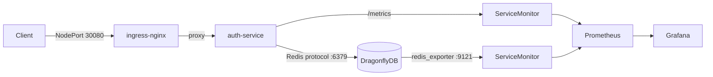

# Advanced Engineer Challenge — Auth Service

> Это решение инженерного челленджа. Оригинальное задание сохранено в [CHALLENGE.md](CHALLENGE.md).

## Стек

| Слой | Технология | Обоснование |
|---|---|---|
| Язык | Kotlin (JVM 21) | Выразительная система типов, value classes для DDD, нативный coroutines support (см. [ADR-001](ADR/ADR-001%20-%20%D0%92%D1%8B%D0%B1%D0%BE%D1%80%20%D1%81%D1%82%D0%B5%D0%BA%D0%B0%20%D0%B8%20%D0%BF%D0%BB%D0%B0%D1%82%D1%84%D0%BE%D1%80%D0%BC%D1%8B.md)) |
| Фреймворк | Ktor (async, lightweight) | Минимальный overhead, нет магии — все явно (см. [ADR-003](ADR/ADR-003-framework.md)) |
| Транспорт | GraphQL (graphql-kotlin) | Единый typed API, schema-first, introspection (см. [ADR-002](ADR/ADR-002-transport-protocol.md)) |
| Хранилище | DragonflyDB (Redis-compat) | In-memory, token storage, drop-in Redis замена (см. [ADR-004](ADR/ADR-004-persistence-layer.md)) |
| Reverse proxy | Nginx | TLS termination, rate-limiting на уровне сети |
| Observability | Prometheus + Grafana | Стандартные порты (9090 / 3000), pull-модель метрик |
| IaC | Terraform + Helm | k3s кластер на Cloud.ru + K8s-чарты |

## Итерации разработки

Решение развивалось последовательно, чтобы не запускать инфраструктуру раньше, чем домен.

**Итерация 1 — In-memory адаптеры**

Порты `UserRepository`, `TokenRepository` реализованы через `ConcurrentHashMap`. Позволяет разрабатывать и тестировать доменную логику без Docker, доменные тесты запускаются без внешних зависимостей.

**Итерация 2 — DragonflyDB адаптеры**

Порты заменяются новыми адаптерами поверх DragonflyDB (Redis-протокол). Доменный модуль не меняется — подмена происходит исключительно в модуле `server/`. Инфраструктурные тесты используют Testcontainers для запуска реального DragonflyDB.

Такое разделение является следствием Ports & Adapters: домен не знает ничего о хранилище.

**Итерация 3 — Kubernetes + Terraform**

Сервис развёрнут в реальном k3s-кластере на Cloud.ru. IaC полностью описывает кластер: установка k3s на master/worker нодах, ingress-nginx, cert-manager, kube-prometheus-stack, auth-service через Helm. Секреты передаются через `TF_VAR_*` переменные окружения, не хранятся в репозитории.

## Архитектура

### Request flow

```
Client → ingress-nginx (:30080) → auth-service (:8080) → DragonflyDB (:6379)
                 ↓
         ServiceMonitor
                 ↓
           Prometheus ← dragonfly ServiceMonitor
                 ↓
            Grafana (:32000)
```



### DDD — bounded context

Доменный модуль (`domain/`) содержит:
- **Aggregates**: `User`, `ResetToken` — инварианты хранятся внутри агрегатов
- **Value Objects**: `Email`, `Password` (bcrypt-хеш), `TokenId`
- **Domain Services**: `PasswordHasher`, `TokenGenerator`
- **Ports** (интерфейсы): `UserRepository`, `TokenRepository`, `RateLimiter`

Инфраструктурный модуль (`server/`) содержит **Adapters** — реализации портов поверх DragonflyDB.

### CQRS

| Command Side | Query Side |
|---|---|
| `RegisterUserCommand` | `GetUserByEmailQuery` |
| `LoginCommand` | `ValidateTokenQuery` |
| `RequestPasswordResetCommand` | — |
| `ConfirmPasswordResetCommand` | — |

Commands мутируют состояние через агрегаты и сохраняют через репозитории. Queries читают напрямую, без side-effects.

### Ключевые бизнес-инварианты

- Email уникален в рамках системы
- Пароль хранится только в виде bcrypt-хеша
- Reset-токен: одноразовый, TTL = 15 минут, повторная отправка блокируется rate limiter'ом
- Rate limiting: реализован через Nginx (`limit_req_zone` по IP, 20 req/s, burst 10); per-email лимиты через DragonflyDB — запланированы (см. [ADR-005](ADR/ADR-005-rate-limiting.md))

## Запуск

### Требования

- Docker ≥ 24
- Docker Compose ≥ 2.20

### Локально (Docker Compose)

```bash
git clone https://github.com/SashaFlake/engineer-challenge.git
cd engineer-challenge
docker compose up --build
```

| Сервис | URL |
|---|---|
| GraphQL API (через Nginx) | http://localhost/graphql |
| GraphQL Playground | http://localhost/graphiql |
| Prometheus | http://localhost:9090 |
| Grafana | http://localhost:3000 (admin / admin) |
| cAdvisor | http://localhost:8081 |

### Kubernetes (Terraform + k3s)

Инфраструктура описана в [`terraform/`](terraform/) и разворачивается одной командой. Кластер поднимается на двух нодах Cloud.ru, все компоненты устанавливаются через Helm.

#### Требования

- Terraform ≥ 1.9
- SSH-доступ к нодам кластера (`~/.ssh/cloudruce`)
- Helm ≥ 3.12 (используется локально для helm_release провайдера)

#### Структура terraform/

| Файл | Что делает |
|---|---|
| `k3s.tf` | Установка k3s на master и worker ноды по SSH, копирование kubeconfig |
| `providers.tf` | Настройка провайдеров: helm, kubernetes |
| `versions.tf` | Версии провайдеров и Terraform |
| `variables.tf` | Все переменные — SSH-ключи, IP-адреса, секреты |
| `ingress-nginx.tf` | Helm-релиз ingress-nginx |
| `cert-manager.tf` | Helm-релиз cert-manager |
| `letsencrypt.tf` | ClusterIssuer для Let's Encrypt (staging/prod) |
| `monitoring.tf` | Helm-релиз kube-prometheus-stack + ConfigMap grafana-dashboards |
| `auth-service.tf` | Namespace `auth` + Helm-релиз auth-service |
| `helm-deps.tf` | `null_resource` для `helm dependency update` перед деплоем |
| `helm.tf` | Провайдер helm через SSH-туннель к kubeconfig |
| `outputs.tf` | Outputs: URL Grafana, URL auth-service |

#### Переменные

Секреты **не хранятся** в `terraform.tfvars` — передаются через переменные окружения:

```bash
export TF_VAR_jwt_secret="..."
export TF_VAR_grafana_admin_password="..."
export TF_VAR_letsencrypt_email="..."
```

Пример остальных переменных — в [`terraform.tfvars.example`](terraform/terraform.tfvars.example).

#### Деплой

```bash
cd terraform
terraform init
terraform apply -auto-approve
```

#### Адреса после деплоя (без домена, по IP)

| Сервис | URL |
|---|---|
| GraphQL API | http://213.171.30.170:30080/graphql |
| GraphQL Playground | http://213.171.30.170:30080/graphiql |
| Grafana | http://213.171.30.170:32000 |

#### Импорт существующих ресурсов

Если ресурсы уже существуют в кластере (например, после ручного создания):

```bash
# namespace auth уже существует
terraform import kubernetes_namespace.auth auth

# ConfigMap grafana-dashboards уже создан вручную
terraform import kubernetes_config_map.grafana_dashboards monitoring/grafana-dashboards
```

### Kubernetes (Helm напрямую)

Helm-чарт также можно установить без Terraform:

```bash
helm dependency update ./helm/auth-service
helm upgrade --install auth-service ./helm/auth-service \
  --namespace auth --create-namespace \
  --values ./helm/auth-service/ip/values-ip.yaml \
  --set secrets.JWT_SECRET="your-secret"
```

## Тесты

Тесты покрывают **domain** (unit) и **infrastructure** (integration с реальным DragonflyDB через Testcontainers).

```bash
# Все тесты
./gradlew test

# Только доменные (без Docker)
./gradlew :domain:test

# Только инфраструктурные
./gradlew :server:test
```

Тестовые сценарии:
- Валидация инвариантов `Password`, `Email`, `ResetToken`
- Полный auth-флоу: register → login → reset-password
- Rate limiting: превышение лимита возвращает `429`

## Observability

### Docker Compose

- **Prometheus** → http://localhost:9090
- **Grafana** → http://localhost:3000 — преднастроенные дашборды (provisioning в `ops/grafana/provisioning/`)

### Kubernetes

- **Grafana** → http://213.171.30.170:32000 — дашборды: auth-service, dragonfly, nginx
- **ServiceMonitor** для auth-service и DragonflyDB — Prometheus Operator подхватывает автоматически
- **ConfigMap** `grafana-dashboards` с лейблом `grafana_dashboard=1` — sidecar grafana-sc-dashboard подхватывает без перезапуска Grafana

Метрики auth-service экспортируются на `/metrics` (Micrometer/Prometheus формат).

## Architecture Decision Records

Ключевые архитектурные решения задокументированы в [`ADR/`](ADR/):

| # | Решение |
|---|---|
| [ADR-001](ADR/ADR-001%20-%20%D0%92%D1%8B%D0%B1%D0%BE%D1%80%20%D1%81%D1%82%D0%B5%D0%BA%D0%B0%20%D0%B8%20%D0%BF%D0%BB%D0%B0%D1%82%D1%84%D0%BE%D1%80%D0%BC%D1%8B.md) | Выбор стека и платформы (Kotlin + Ktor) |
| [ADR-002](ADR/ADR-002-transport-protocol.md) | Транспортный протокол (GraphQL vs REST vs gRPC) |
| [ADR-003](ADR/ADR-003-framework.md) | Выбор фреймворка (Ktor vs Spring Boot) |
| [ADR-004](ADR/ADR-004-persistence-layer.md) | Слой персистентности (DragonflyDB vs PostgreSQL) |
| [ADR-005](ADR/ADR-005-rate-limiting.md) | Rate limiting (Nginx — реализовано; DragonflyDB — запланировано) |

## Trade-offs

| Решение | Что выиграли | Что потеряли |
|---|---|---|
| DragonflyDB вместо PostgreSQL | Скорость, встроенный TTL для токенов | Нет ACID-транзакций между разными типами данных |
| GraphQL вместо REST | Типизированный контракт, introspection | Сложнее кэшировать, HTTP-кэш не применим напрямую |
| Ktor вместо Spring Boot | Минимальный overhead, явная конфигурация | Меньше готовых интеграций «из коробки» |
| Nginx для rate limiting (без DragonflyDB-слоя) | Edge-защита без кода в приложении | Нет защиты от брутфорса по email с разных IP (планируется добавить) |
| Terraform + k3s вместо managed K8s | Полный контроль, воспроизводимость, дешевле | Больше операционной ответственности (control plane, обновления) |

## До production

**Структурированные логи**

Сейчас метрики есть, логов нет. Для отладки инцидентов в проде нужны структурированные логи: `logback` в JSON-формате с полями `traceId`, `userId`, `operation`. Без этого при ошибке непонятно, что именно пошло не так и для кого.

**Отправка email при reset-password**

Токен генерируется и хранится, но письмо не уходит. Порт `NotificationSender` уже выделен в домене — нужен адаптер: SMTP для простого случая или вызов через message broker если нужна надёжная доставка с retry.

**Нагрузочное тестирование**

Неизвестно, сколько RPS выдерживает сервис и при каком p99. Нужно прогнать `k6` по сценариям login/register/reset, зафиксировать baseline и добавить порог в CI — чтобы регрессия по производительности была видна сразу.

**Durability у DragonflyDB**

DragonflyDB сейчас работает без persistence: перезапуск пода уничтожает все данные — токены, пользователи. Нужно либо включить RDB/AOF снапшоты, либо перейти на managed Redis-совместимый сервис с гарантированным persistence.

**Алерты**

Grafana и дашборды есть, но Alertmanager не настроен — инцидент никуда не прилетит. Минимальный набор: `error_rate > 1%` за 5 минут, `p99 latency > 500ms`, `dragonfly_up == 0`.

**TLS**

Cert-manager и ClusterIssuer для Let's Encrypt задеплоены, но сертификат не выпущен — нет домена. Как только появится домен, достаточно задать `var.grafana_hostname` и `var.auth_hostname` и включить ingress в соответствующих `values`.

## Использование ИИ

В процессе работы использовался Perplexity AI — в роли **engineering assistant**, а не decision-maker. Подробнее — в [`.agents/perplexity.md`](.agents/perplexity.md).
